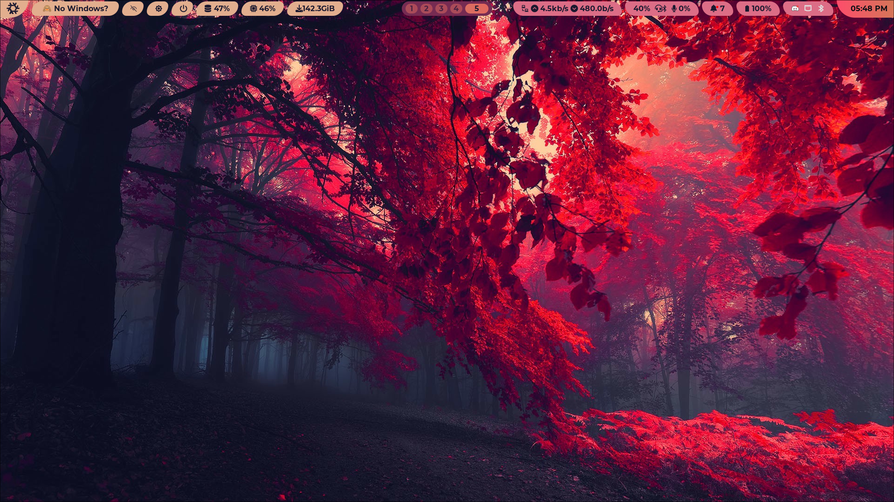
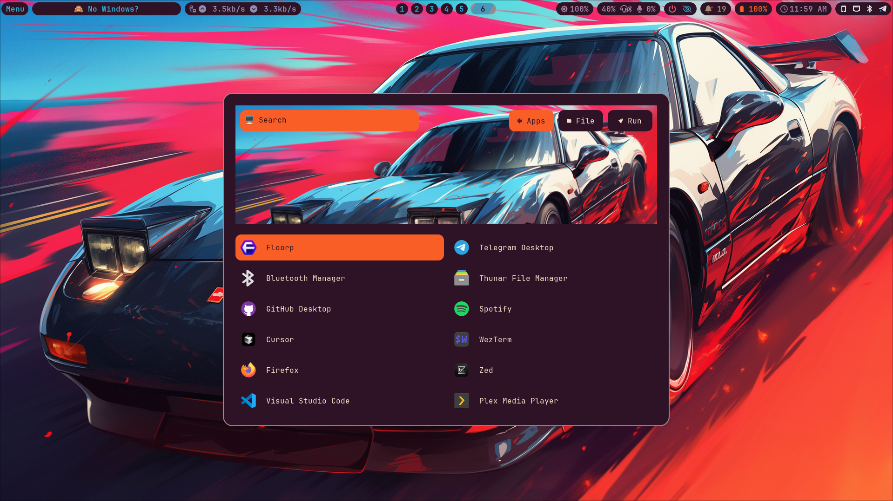
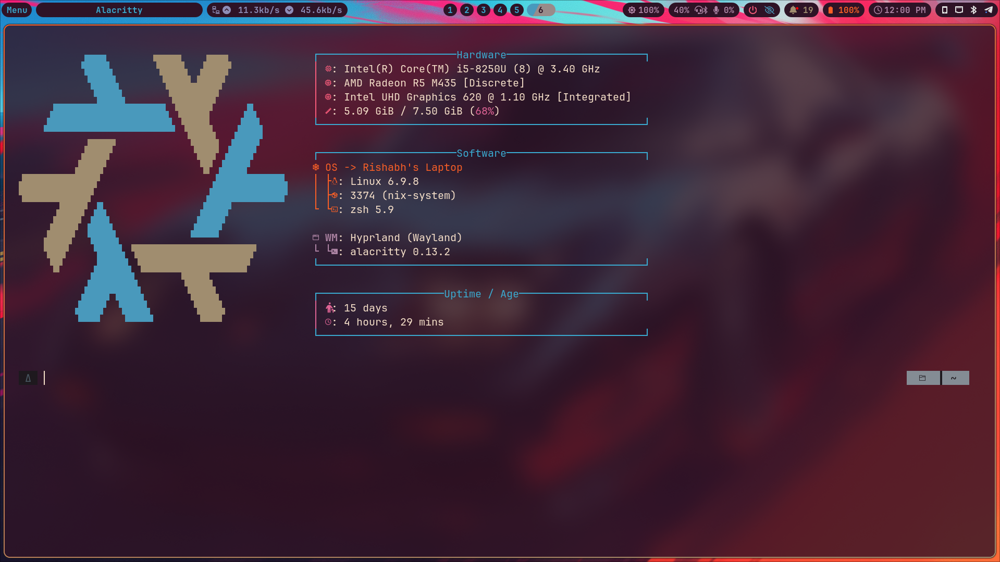
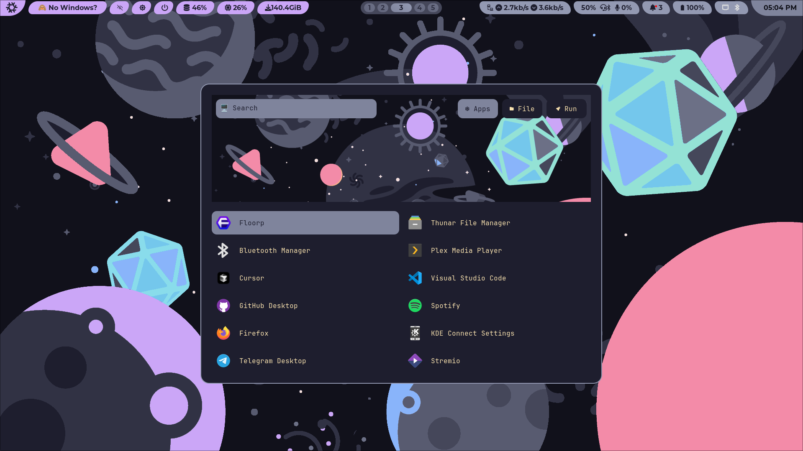
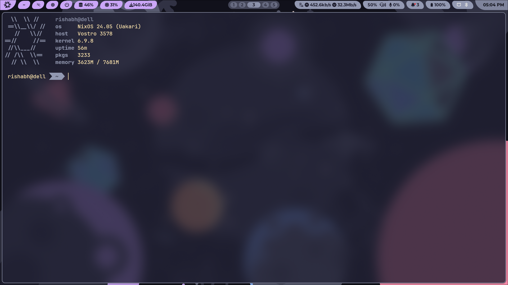

```
 _   _ _       ___  ____         ____             __  _                 ____        _    __ _ _
| \ | (_)_  __/ _ \/ ___|       / ___|___  _ __  / _ (_)  __ _     _    |  _ \  ___ | |_ / _(_) | ___  ___
|  \| | \ \/ / | | \___ \ _____| |   / _ \| '_ \| |_ | | / _` |  _| |_  | | | |/ _ \| __| |_| | |/ _ \/ __|
| |\  | |>  <| |_| |___) |_____| |__| (_) | | | |  _ | |  (_| | |_   _| | |_| | (_) | |_|  _| | |  __/\__ \
|_| \_|_/_/\_\\___/|____/       \____\___/|_| |_|_|  |_| \__, |   |_|   |____/ \___/ \__|_| |_|_|\___||___/
                                                         |___/




